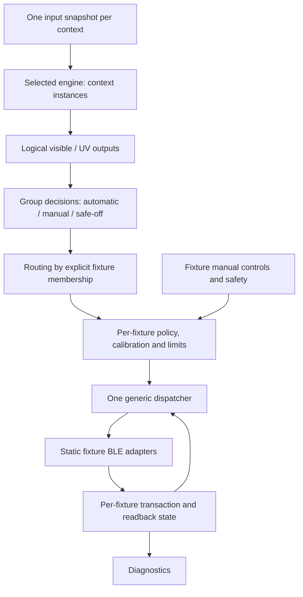

# Fixture topology architecture: T05/T06 revision

Status: architecture implemented in a generic software path; physical evidence and future profile integration remain outstanding. Prepared 30 September
2026 against T06 commit `e505851` and merged T05 commit `461783b`.
PR #6 was still open when this plan was written. It merged before the
`refactor/fixture-topology` branch started from the documentation commit and
current `master`.

Source: the owner's attached discussion beginning “Yes. That scenario changes
the architectural recommendation in an important way…”. It proposes independent
physical fixtures, logical outputs, control groups and build-time topology.
This document settles the remaining semantics for implementation. The actual
existing mapping is **0 = JungleDawn, 1 = ProT5**. Neither index shall imply a
product, visible/UV role, enclosure or policy in the replacement architecture.

This plan supersedes the fixed-slot assumptions in `../architecture.md` and
`../../todo.md` for future work. The original T05/T06 evidence remains historical
evidence for the two-slot implementation. Execution steps are in
[the implementation runbook](fixture-topology-implementation.md).

## Scope and decisions

- A fixture is one physical BLE device with a stable identity.
- A group is one shared control decision routed to one or more fixtures of the
  same lighting role. A group may span vivariums.
- A policy context owns an independent set of engine parameters. One seasonal
  context can supply both `visible` and `uv` outputs; this does not make those
  outputs physical fixture slots.
- A location is descriptive metadata. It neither chooses a group nor changes
  the algorithm. The device's Home Assistant area remains device-level metadata;
  fixture location labels do not promise independent HA area assignment.
- Initial architectural bounds: four physical fixture slots, four groups and
  two policy contexts. One engine family is selected for the whole build.
  Independent contexts of that family are allowed. Mixed seasonal/schedule
  engines and runtime topology editing are deferred.
- Deliver a generic two-fixture implementation first. Compile/simulation support
  for three/four fixtures follows. Production support for those counts requires
  recorded ESP32-C3 resource and physical BLE evidence.
- Keep a single global transaction arbiter. Four configured fixtures does not
  mean four simultaneous BLE connections or writes.

## Domain model and identity

| Object | Build-time fields | Runtime state/settings | Must not own |
| --- | --- | --- | --- |
| Policy context | Stable `context_id`, engine family, input provider binding | Seasonal parameters or later schedule settings; coherent evaluation snapshot and revision | MACs, fixture indices, caps, retries |
| Logical output | `(context_id, role)` where role is `visible` or `uv` | Validity, desired fraction, peak fraction, reason, source/simulation flag, evaluation revision | BLE state, rounded physical targets |
| Control group | Stable `group_id`, logical-output reference | Automatic enable, group manual override/fraction and decision revision | Member calibration or connection state |
| Physical fixture | Stable `fixture_id`, explicit slot, product type, derived role/protocol, group reference, optional location label, enabled flag, MAC when enabled | Maximum/calibration, local manual override/percent, requested/pending/in-flight/completed/reported state, retry/readback diagnostics | Engine parameters or inferred group membership |
| Transport adapter | Static fixture/client/script bindings and protocol identifier | Connection lifecycle, framing, writes and readback parsing | Seasonal/UV policy, group arbitration |

Names are labels; stable IDs are configuration and persistence keys. Slots are
explicit unique integers 0–3 used only for bounded storage and static dispatch.
Do not renumber fixtures because declarations are reordered or a slot is absent.
Sparse slots are valid. Loops use enabled descriptors, never `slot == 0` to
select a role or `1 - slot` to select the next fixture.

For this refactor an enabled fixture with validated type, group and real MAC is
build-time commissioned; automatic control still defaults off. There is no new
runtime pairing step. T20 may later add an explicit commissioning state, which
must gate the same fixture policy boundary. Keep bootstrap separate.

The first product catalogue contains:

| Product type | Role | Protocol adapter | New fixture maximum default |
| --- | --- | --- | --- |
| `jungle_dawn` | `visible` | `luminize_v1` | 100% |
| `prot5` | `uv` | `luminize_v1` | 0%, requiring fixture-specific calibration |

These adapters reflect the identical frames currently present in the repository,
not a claim about all product/firmware revisions. Verify both paths during the
refactor. Product type is mandatory; derive role/protocol from the catalogue and
reject conflicting overrides. The dispatcher uses adapter bindings, not product
names. Future products require an explicit catalogue entry and acceptance cases.

## Composition and data flow



Only per-fixture policy submits operational dispatcher targets. Routing fans out
one group decision and never writes BLE directly. The engine cannot read fixture
identity, group controls, maxima or transaction state. Diagnostics cannot submit
commands. One orchestrator evaluates each context once per evaluation tick, then
its groups, then members. One separate dispatcher tick services all fixtures.

Shared settings are expressed by sharing a context reference. Shared manual and
automatic decisions are expressed by sharing a group. Two distinct contexts
with identical initial settings remain independent; never deduplicate them by
comparing current values.

Boundary records (conceptual interfaces, not a prescribed C++ ABI):

- `EvaluationSnapshot(context_id, revision, valid, date, local_minutes,
  days_in_year, provider, simulated)` is immutable during an evaluation.
- `EngineOutput(context_id, role, revision, valid, desired_fraction,
  peak_fraction, reason, simulated)` has finite `0 <= desired <= peak <= 1`.
  It contains no physical target. Reject malformed records at the policy boundary.
- `GroupDecision(group_id, revision, source, valid, fraction, reason,
  snapshot_revision)` represents demand before fixture calibration. Safety-off
  and hold/cancel are explicit actions, not ambiguous fractions or sentinel NaNs.
- `AcceptedTarget(fixture_id, generation, source, group_revision,
  target_percent, reason)` is emitted only by fixture policy. Rejection cannot
  reuse a previous accepted value through shared mutable scratch state.
- `TransportEvent(fixture_id, transaction_token, event, reported_percent,
  monotonic_timestamp)` carries explicit completion/failure/readback meaning.
  A write completion alone cannot set the reported physical level.

Use fixed-size records or parameterised scripts with equivalent semantics.
Do not introduce a message bus or dynamically allocated object graph.

## Output units and control semantics

Automatic and group-manual values are finite fractions in `[0, 1]` of **each
fixture's own configured maximum**. A shared visible demand of 0.72 with fixture
caps of 100% and 60% produces commands of 72% and 43%. It does not guarantee equal
physical brightness, equal UV exposure, or simultaneous radio delivery.

The engine supplies `desired_fraction` and `peak_fraction` (the latter preserves
the existing endpoint/minimum-change behavior). Group manual is a fraction,
labelled “% of fixture maximum”. Existing fixture manual controls remain integer
absolute lamp percentages, capped by that fixture's maximum. Group manual does
not copy calibration between members.

For each fixture, resolve this priority:

1. Absent, disabled or uncommissioned fixture: no operational transaction.
2. Active invalid-time safety or an explicit safe-off decision: 0%.
3. Active fixture manual override: capped absolute fixture percentage.
4. Active group manual override: group fraction scaled by the fixture maximum.
5. Group automatic enabled and valid live engine output: scaled engine fraction.
6. Hold existing physical output; cancel pending requests from a revoked source.

An invalid maximum rejects nonzero requests; it cannot prevent a 0% safety
request. Invalid engine output revokes only automatic requests. It does not
erase independent manual state or reported lamp values. Define sources as named
values (`automatic`, `group_manual`, `fixture_manual`, `safety`) and retain source
and decision revision with each accepted target.

Group automatic-off cancels that group's pending automatic targets on all
members; it does not send off and does not cancel independent fixture manual
requests. Entering fixture manual affects only that fixture. Leaving fixture
manual immediately reevaluates its current group decision. Group manual affects
members without a higher-priority override; disabling it reevaluates automatic
or hold. Manual overrides default off at boot and last until explicitly released.

Explicit safe-off is an event, not a new persistent latch. Controller safe-off
disables all groups' automatic/manual controls, clears fixture overrides and
submits 0% to all enabled fixtures. Group safe-off does the same within that
group. Fixture safe-off activates that fixture's local override at 0%, leaving
other group members alone. A later deliberate manual request or automatic-enable
can supersede explicit safe-off on the next policy evaluation, subject to active
invalid-time safety. Until then, the policy retains the pending 0% safety request
while the disabled group resolves to hold; that hold must not revoke the off
request. Active invalid-time safety remains highest priority and cannot be
overridden by manual or automatic controls. These scope extensions preserve
T06's controller-button semantics; do not introduce persistent safety latches or
new Resume entities in this refactor.

Retain T06's live-clock behavior: invalid clock grace is elapsed controller uptime,
not time since the last clock failure; invalid time after grace with fail-safe
enabled requests off even during manual override. No new time-since-sync expiry
is introduced. Preserve bounded monotonic retry timers and document rollover
tests. Once boot grace expires, monotonic-counter rollover cannot restart it.
Use one captured validity decision per evaluation, not repeated clock
reads to reconstruct request source.

Calculation-only simulated input cannot fan out into operational requests.
Real-clock safety remains independent of simulation. Removing T06's simulation
bypass of invalid-time safety is an explicit coordinated T07 change, not a
mechanical T05R extraction. Until that change is verified, development profiles
must remain labelled as retaining the old behavior.

Maximum changes require reevaluating that fixture immediately. A reduction below
an outstanding target replaces it even if the ordinary minimum-change threshold
would suppress the difference. An in-flight write may finish first; report that
state rather than implying the reduced output is already achieved. Manual and
safety requests bypass automatic change thresholds. Apply scaling/capping only
at the fixture policy boundary; preview uses the same conversion routine.

## Pending requests, failure and reconnect

Keep requested, pending, in-flight, completed write, reported value and report
freshness separate per fixture. Each request has a generation; each transaction
captures fixture identity, generation and target. Queue coalescing keeps the
latest authorised target per fixture. Cancellation advances its generation and
revokes pending/retry eligibility without stopping a wire sequence halfway.

Evaluation revisions and request generations are different. Recalculating an
unchanged automatic target from the same source must not reset attempts, backoff
or report freshness. Advance request generation for a changed target/source,
revocation, explicit new user request or scheduled recovery attempt. Preserve
bounded retry limits under repeated identical automatic evaluations. Group
delivery diagnostics track the accepted member generations, not every fresh
engine evaluation that leaves their targets unchanged.

Old completion/failure callbacks must not clear a newer pending target, recreate
a cancelled request, or release another fixture's active transaction. Add a
transaction token to correlate callbacks; request generation alone is not a
substitute for guarding the global transaction lifecycle. Retain the arbiter
until script termination and disconnect/timeout cleanup have completed, then
allow the next adapter to start.

Tokens are internal callback/lifecycle identifiers; the current lamp wire protocol
does not supply them. Correlate notifications with the bound client, active
connection and readback window. Do not claim that a local token proves a delayed
device notification was caused by that request. Out-of-window reports may update
last-observed state but cannot mark a newer command confirmed.

Use round-robin selection over enabled slots after the global quiet interval,
subject to each fixture's same-device interval and retry backoff. A disconnected
fixture gets bounded attempts; it cannot indefinitely block healthy members.
Retry/recovery always reevaluates whether the latest decision is still
authorised. No cached group target can revive an old manual or safe-off state.

A shared group has independent physical outcomes. Report partial delivery if one
member fails; do not roll back successful members or claim group confirmation
from one readback. “All confirmed” requires a fresh matching report for each
enabled member's own authorised target/revision. A disconnected off request
leaves physical output unknown; retain its last report, age and communication
fault. An empty group is configuration-invalid, not vacuously confirmed.

## Build-time topology contract

The following is a **conceptual schema**, not ESPHome YAML that works today:

```yaml
topology_version: 1
engine_family: seasonal
allow_experimental_topology: true  # Required here: three enabled fixtures.
contexts:
  - id: shared_climate
groups:
  - id: shared_visible
    context: shared_climate
    output: visible
  - id: shared_uv
    context: shared_climate
    output: uv
fixtures:
  - id: viv_a_visible
    slot: 0
    enabled: true
    type: jungle_dawn
    group: shared_visible
    location: Vivarium A
    mac: !secret viv_a_visible_mac
  - id: viv_b_visible
    slot: 1
    enabled: true
    type: jungle_dawn
    group: shared_visible
    location: Vivarium B
    mac: !secret viv_b_visible_mac
  - id: viv_a_uv
    slot: 2
    enabled: true
    type: prot5
    group: shared_uv
    location: Vivarium A
    mac: !secret viv_a_uv_mac
  - id: viv_b_uv
    slot: 3
    enabled: false
```

Disabled entries reserve only an ID/slot and have no MAC requirement, client,
transaction script, normal entity, group membership or persisted calibration.
Enabled entries require all descriptors. Only enabled entries count toward the
active hardware support limit; all reserved slots must be unique and in range.

Reject invalid topology during ESPHome configuration validation, including in
Device Builder and remote package imports, before producing usable firmware:

- Duplicate/invalid IDs, duplicate/out-of-range slots, unsupported versions,
  product types, engine families, roles or adapter mappings.
- Missing, zero-placeholder, broadcast or duplicate MACs among enabled fixtures;
  resolve secrets before comparing and redact MACs in diagnostics/errors.
- Unknown group/context, role mismatch, multiple group memberships, unused groups
  or contexts, and more than four groups or two contexts.
- More enabled fixtures than the selected board/profile support level. Three/four
  require an explicit experimental topology opt-in until the hardware gate passes.
- `allow_experimental_topology` defaults false; enabling it changes only build
  eligibility and must not claim production support or relax the other rules.
- Zero enabled fixtures for an operational profile. Bootstrap is a distinct
  future composition, not an operational build silently doing nothing.
- Duplicate client bindings, missing adapter scripts, duplicate callbacks,
  multiple orchestrators/dispatchers, or production references to test providers.

The old all-disabled CI fixture must therefore become an expected validation
failure for the new operational entry point. Preserve legacy behavior under the
old entry point until its documented migration/release decision.

Group automatic controls default off. New group manual overrides default off
with demand 0%. Fixture manual restore/default behavior follows the legacy
adapter for migrated entities and defaults off for new identities. Disabling a
fixture removes its generated artifacts; re-enabling it must be checked against
its physical-assignment fingerprint before restoring settings.

Topology, MACs, IDs, product role, membership and engine family change only by
rebuilding. Runtime controls change parameter values, enable/manual state and
per-fixture calibration, never group membership or BLE client construction.

## ESPHome composition strategy

Start with reusable YAML package fragments instantiated with explicit include
variables and stable prefixes. Each enabled fixture contributes its own static
BLE client, protocol binding and fixture entities; each context/group contributes
only its own settings/state. Keep the top-level package as the composition root.
No host-only generation command may become mandatory for Device Builder users.

The first implementation step must prove repeated includes, conditional omission,
namespace uniqueness and cross-reference validation on the pinned ESPHome 2026.9.0
toolchain. Do not present the conceptual schema above as native ESPHome syntax.
If native package validation cannot enforce the topology rules, the prescribed
fallback is a small repository-hosted `lumineze_topology` external component for
schema/final validation and static descriptors/bindings only. It must share the
package's pinned Git revision and work in local and remote builds. Keep policy,
engine and transaction sequencing out of that helper; no dynamic BLE discovery
or wholesale controller component rewrite is part of this work.

Record the chosen syntax and proof in the first refactor commit, then freeze it
for subsequent steps. Stop with the specific failed proof if neither approach
supports the required remote/Device Builder workflow; do not weaken validation
or expand into a general code generator unattended.

ESPHome documents [package composition](https://esphome.io/components/packages/)
and [Git-hosted external components](https://esphome.io/components/external_components/).
These are implementation mechanisms, not proof that the proposed schema exists.
The [BLE component documentation](https://esphome.io/components/esp32_ble/) makes
connection configuration a separate concern; choose the connection allocation
from the serialized adapter lifecycle and verify it on the pinned build. Do not
set `max_connections` to four merely because four fixtures are declared.

## Module ownership after T05R/T06R

Paths below are planned boundaries; combine tiny files where that improves clarity.

| Boundary | Responsibilities | Existing material to evolve |
| --- | --- | --- |
| `topology/` | Validated static descriptors, counts, identity and binding table | Product-specific substitutions in `core/base.yaml` |
| `inputs/`, `core/orchestrator.yaml` | Snapshot/provider selection and one evaluation loop | Clock/test reads in seasonal; 10-second tick in dispatcher |
| `modes/seasonal/` | Context parameters, pure visible/UV calculations and output records | Single instance `modes/seasonal.yaml` |
| `core/groups.yaml` | Group enable/manual/safe-off events and decision revisions | Automatic control branches in `core/control.yaml` |
| `core/routing.yaml` | Resolve group memberships and fan out decisions | Current two-element engine-to-lamp correspondence |
| `core/fixture-policy.yaml` | Local override/safety, limits, threshold and target authorization | T06 `submit_control_target`, calibration/manual entities |
| `core/dispatcher.yaml` | Generic pending/retry state and global round-robin arbiter | Two-slot loops, `1 - lamp`, product-specific dispatch branches |
| `transport/luminize/` | Parameterised static BLE adapters and shared frame/readback logic | `core/ble.yaml`, `lamps/protocol.yaml`, notification sensors |
| `features/diagnostics/` | Context/group/fixture views, partial delivery and readback freshness | Hard-coded JungleDawn/ProT5 entity definitions |
| `compat/legacy-two-fixture.yaml` | Explicit old-name/topology mapping only | Public `lumineze-controller.yaml` and old substitutions |

Split state by owner. Fixed arrays of four are acceptable, with typed descriptors
and enabled-slot iteration; there is no requirement for dynamic allocation.
Named fixture-to-adapter branches are acceptable only in the generated/static
binding layer. Common policy and dispatch cannot branch on product names or slot
numbers to choose meaning. Diagnostic labels may name products without deciding
behavior. Manual level control remains operational when T07 removes test facilities.

## Compatibility and persistence

Keep the original public package path as an explicit legacy adapter mapping
JungleDawn to a visible group and ProT5 to a UV group in one context. The new
generic entry point uses fixture IDs; never guess topology from MAC presence or
reinterpret old ProT5 settings as a second visible fixture. The legacy adapter
may know the old two-slot mapping; shared modules may not.

| Legacy setting/entity | New owner in compatibility composition |
| --- | --- |
| Shared latitude/noon/phase and visible/UV curve parameters | One legacy seasonal context, with role-specific curve/window parameters |
| JungleDawn/ProT5 automatic switches | Their respective visible/UV groups |
| Existing manual override and requested-level entities | Their respective fixtures; absolute percent semantics retained |
| Maximum/calibrated maximum | Their respective physical fixtures |
| Minimum automatic change | Per-fixture policy setting, applied after scaling |
| BLE interval/retry/recovery settings | Existing controller-wide defaults used by the generic dispatcher, retaining separate per-fixture counters |
| Last queued curve level | Per-fixture last accepted automatic target, not the shared group fraction |

A group membership edit with unchanged fixture ID/type/MAC retains that physical
fixture's calibration, but cancels old requests/overrides and starts the affected
group's automatic control off. Moving a fixture to another slot is an explicit
migration requiring persistence evidence; do not infer it from declaration order.

Keep legacy entity names/identity and restore keys where supported. First export
the generated ID/entity/preference inventory; a stable YAML `id` alone does not
prove stable HA identity or restored settings. A persistence fixture must verify
the mapping before any automatic migration claim. If exact preservation fails,
document a versioned explicit migration and require user-restored settings.

Key new calibration persistence by fixture identity **and physical assignment**
(product/protocol/MAC fingerprint). A new device, changed product or reassigned
slot must not inherit another lamp's maximum. New/reassigned UV fixtures start
at 0%; topology changes default affected automatic groups off and clear pending,
in-flight and manual state. Do not restore transaction state across boots. Group
membership changes must have an explicit migration record and cannot copy a
calibration value. Label-only edits do not reset settings.

Preserve `v1.0.0` and other release tags. Recovery uses the owner's private
known-good YAML, secrets, settings and verified flashing route. No unattended
step flashes a live enclosure or claims physical verification from CI.
